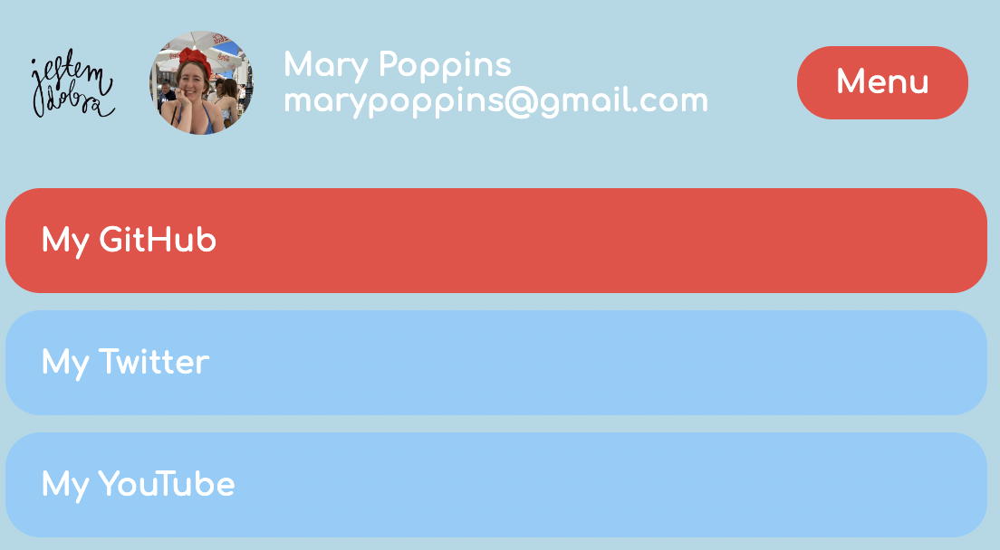

# 🌺 Dropdown menu

## 🩰 What's it about?

A spark of JS we can see, when we click on a menu button and a drop down menu appears. 💍 Using .classList property and click event.

## 🩰 First look 

This is a desktop view

and here it is a mobile view

## 🩰 Technologies

+ HTML
+ CSS

## 🩰 Sources
This little project is part of an amazing Full Stack Developer Course created by ♥ Ania Kubow ♥. Love this women, her sense of humor and ability to explain hard, code-things in a way that I finally understand. 🏆
You can check this course [here](https://www.codewithania.com/about) and I absolutely encourage You to visit her [YouTube](https://www.youtube.com/@AniaKubow) channel .
